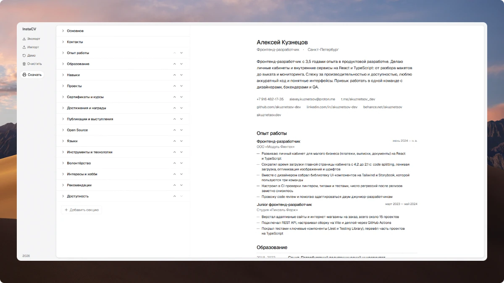

# Insta CV

Онлайн-редактор резюме: слева форма, справа лист A4, который меняется по мере ввода. Регистрация и сервер не нужны, данные хранятся только в вашем браузере. Готовое резюме можно распечатать или сохранить в PDF.



## Технологии

| Что           | Чем                                                        |
| ------------- | ---------------------------------------------------------- |
| Сборка        | Vite 8, TypeScript 6                                       |
| Интерфейс     | Preact 11, `@preact/signals`                               |
| Данные        | zod 4: одна схема для формы, превью и файлов               |
| Стили         | Tailwind CSS 4, шрифт Geist                                |
| Иконки        | Lucide, Font Awesome Brands (через Iconify, только нужные) |
| Качество      | ESLint, Prettier, Vitest                                   |
| Хранение      | localStorage, экспорт и импорт JSON                        |
| Развёртывание | GitHub Actions → GitHub Pages                              |

## Как пользоваться

1. Заполните поля слева. Обязательны имя, должность, «О себе» и хотя бы один контакт. Пустые секции в резюме не попадают.
2. Секции можно переименовать, переставить стрелками в заголовке и добавить свою кнопкой «Добавить секцию».
3. Справа лист A4 в том виде, в каком он выйдет на бумаге. Длинное резюме продолжается на следующих листах.
4. Нажмите «Скачать» (или Ctrl+P) и выберите принтер или «Сохранить как PDF». Если что-то не заполнено, редактор предупредит и подсветит поля.

На телефоне вместо двух колонок вкладки «Редактор» и «Превью».

### Данные

Всё сохраняется автоматически в localStorage, ссылки на резюме нет. Поэтому:

- **«Экспорт»** скачивает резюме JSON-файлом: резервная копия и перенос в другой браузер.
- **«Импорт»** загружает такой файл обратно.
- **«Демо»** открывает пример, **«Очистить»** начинает с пустого листа (оба спрашивают подтверждение).

В приватном режиме браузер может запретить сохранение, тогда редактор покажет предупреждение: сделайте экспорт перед уходом.

## Разработка

Нужны Node.js 22.18+ и pnpm 11 (`corepack enable` подтянет его сам).

```bash
pnpm install
pnpm dev
```

Откройте http://127.0.0.1:5173.

| Команда                    | Что делает                                        |
| -------------------------- | ------------------------------------------------- |
| `pnpm dev`                 | Dev-сервер с горячей перезагрузкой                |
| `pnpm build`               | Сборка в `dist`                                   |
| `pnpm preview`             | Просмотр собранной версии                         |
| `pnpm test`                | Тесты                                             |
| `pnpm check`               | Проверка типов                                    |
| `pnpm lint`                | ESLint                                            |
| `pnpm format`              | Prettier: форматирование                          |
| `pnpm format:check`        | Prettier: проверка без правок                     |
| `pnpm check-resume [файл]` | Проверка файла резюме, по умолчанию `resume.json` |

### Структура

| Папка         | Что внутри                                                       |
| ------------- | ---------------------------------------------------------------- |
| `src/config`  | Схема резюме, нормализация контактов, тексты по умолчанию        |
| `src/state`   | Черновик в signals, автосохранение, формат файла и миграции      |
| `src/editor`  | Форма: секции, поля, редактор списков, ошибки, печать            |
| `src/preview` | Вёрстка резюме и лист A4 в iframe                                |
| `src/lib`     | Общие функции для превью: контакты, абзацы, порядок секций       |
| `src/data`    | Демо-резюме                                                      |
| `src/styles`  | `theme.css` токены, `app.css` редактор, `resume.css` лист резюме |
| `build`       | Плагины Vite: иконки брендов, предзагрузка шрифтов, SEO          |
| `scripts`     | `check-resume.ts`: проверка файла резюме без браузера            |
